```mermaid
flowchart TB
    subgraph current["SimConnect_To_IP.csproj"]
        MAIN["<b>⚙️&nbsp;SimConnect_To_IP.csproj</b><br/><small>net48</small>"]
        click MAIN "#windowsformsapp2simconnect_to_ipcsproj"
    end

```

# Projects and dependencies analysis

This document provides a comprehensive overview of the projects and their dependencies in the context of upgrading to .NETCoreApp,Version=v10.0.

## Table of Contents

- [Executive Summary](#executive-Summary)
  - [Highlevel Metrics](#highlevel-metrics)
  - [Projects Compatibility](#projects-compatibility)
  - [Package Compatibility](#package-compatibility)
  - [API Compatibility](#api-compatibility)
- [Aggregate NuGet packages details](#aggregate-nuget-packages-details)
- [Top API Migration Challenges](#top-api-migration-challenges)
  - [Technologies and Features](#technologies-and-features)
  - [Most Frequent API Issues](#most-frequent-api-issues)
- [Projects Relationship Graph](#projects-relationship-graph)
- [Project Details](#project-details)

  - [WindowsFormsApp2\SimConnect_To_IP.csproj](#windowsformsapp2simconnect_to_ipcsproj)

## Executive Summary

### Highlevel Metrics

| Metric | Count | Status |
| :--- | :---: | :--- |
| Total Projects | 1 | All require upgrade |
| Total NuGet Packages | 0 | All compatible |
| Total Code Files | 6 |  |
| Total Code Files with Incidents | 5 |  |
| Total Lines of Code | 1134 |  |
| Total Number of Issues | 297 |  |
| Estimated LOC to modify | 295+ | at least 26.0% of codebase |

### Projects Compatibility

| Project | Target Framework | Difficulty | Package Issues | API Issues | Est. LOC Impact | Description |
| :--- | :---: | :---: | :---: | :---: | :---: | :--- |
| [WindowsFormsApp2\SimConnect_To_IP.csproj](#windowsformsapp2simconnect_to_ipcsproj) | net48 | 🟡 Medium | 0 | 295 | 295+ | ClassicWpf, Sdk Style = False |

### Package Compatibility

| Status | Count | Percentage |
| :--- | :---: | :---: |
| ✅ Compatible | 0 | 0.0% |
| ⚠️ Incompatible | 0 | 0.0% |
| 🔄 Upgrade Recommended | 0 | 0.0% |
| ***Total NuGet Packages*** | ***0*** | ***100%*** |

### API Compatibility

| Category | Count | Impact |
| :--- | :---: | :--- |
| 🔴 Binary Incompatible | 293 | High - Require code changes |
| 🟡 Source Incompatible | 2 | Medium - Needs re-compilation and potential conflicting API error fixing |
| 🔵 Behavioral change | 0 | Low - Behavioral changes that may require testing at runtime |
| ✅ Compatible | 1281 |  |
| ***Total APIs Analyzed*** | ***1576*** |  |

## Aggregate NuGet packages details

| Package | Current Version | Suggested Version | Projects | Description |
| :--- | :---: | :---: | :--- | :--- |

## Top API Migration Challenges

### Technologies and Features

| Technology | Issues | Percentage | Migration Path |
| :--- | :---: | :---: | :--- |
| Windows Forms | 293 | 99.3% | Windows Forms APIs for building Windows desktop applications with traditional Forms-based UI that are available in .NET on Windows. Enable Windows Desktop support: Option 1 (Recommended): Target net9.0-windows; Option 2: Add <UseWindowsDesktop>true</UseWindowsDesktop>; Option 3 (Legacy): Use Microsoft.NET.Sdk.WindowsDesktop SDK. |
| Legacy Configuration System | 2 | 0.7% | Legacy XML-based configuration system (app.config/web.config) that has been replaced by a more flexible configuration model in .NET Core. The old system was rigid and XML-based. Migrate to Microsoft.Extensions.Configuration with JSON/environment variables; use System.Configuration.ConfigurationManager NuGet package as interim bridge if needed. |

### Most Frequent API Issues

| API | Count | Percentage | Category |
| :--- | :---: | :---: | :--- |
| T:System.Windows.Forms.Button | 91 | 30.8% | Binary Incompatible |
| T:System.Windows.Forms.RichTextBox | 12 | 4.1% | Binary Incompatible |
| P:System.Windows.Forms.Control.Name | 12 | 4.1% | Binary Incompatible |
| T:System.Windows.Forms.ListBox | 11 | 3.7% | Binary Incompatible |
| T:System.Windows.Forms.Label | 11 | 3.7% | Binary Incompatible |
| T:System.Windows.Forms.Control.ControlCollection | 11 | 3.7% | Binary Incompatible |
| P:System.Windows.Forms.Control.Controls | 11 | 3.7% | Binary Incompatible |
| M:System.Windows.Forms.Control.ControlCollection.Add(System.Windows.Forms.Control) | 11 | 3.7% | Binary Incompatible |
| P:System.Windows.Forms.Control.TabIndex | 11 | 3.7% | Binary Incompatible |
| P:System.Windows.Forms.Control.Size | 11 | 3.7% | Binary Incompatible |
| P:System.Windows.Forms.Control.Location | 11 | 3.7% | Binary Incompatible |
| E:System.Windows.Forms.Control.Click | 9 | 3.1% | Binary Incompatible |
| P:System.Windows.Forms.ButtonBase.UseVisualStyleBackColor | 8 | 2.7% | Binary Incompatible |
| P:System.Windows.Forms.ButtonBase.Text | 8 | 2.7% | Binary Incompatible |
| M:System.Windows.Forms.Button.#ctor | 8 | 2.7% | Binary Incompatible |
| T:System.Windows.Forms.Timer | 6 | 2.0% | Binary Incompatible |
| T:System.Windows.Forms.Application | 3 | 1.0% | Binary Incompatible |
| P:System.Windows.Forms.Control.Enabled | 3 | 1.0% | Binary Incompatible |
| T:System.Windows.Forms.AutoScaleMode | 3 | 1.0% | Binary Incompatible |
| T:System.Windows.Forms.ListBox.ObjectCollection | 2 | 0.7% | Binary Incompatible |
| P:System.Windows.Forms.ListBox.Items | 2 | 0.7% | Binary Incompatible |
| M:System.Windows.Forms.ListBox.ObjectCollection.Add(System.Object) | 2 | 0.7% | Binary Incompatible |
| P:System.Windows.Forms.Timer.Enabled | 2 | 0.7% | Binary Incompatible |
| P:System.Windows.Forms.RichTextBox.Text | 2 | 0.7% | Binary Incompatible |
| M:System.Windows.Forms.Form.#ctor | 2 | 0.7% | Binary Incompatible |
| M:System.Windows.Forms.Application.Run(System.Windows.Forms.Form) | 1 | 0.3% | Binary Incompatible |
| M:System.Windows.Forms.Application.SetCompatibleTextRenderingDefault(System.Boolean) | 1 | 0.3% | Binary Incompatible |
| M:System.Windows.Forms.Application.EnableVisualStyles | 1 | 0.3% | Binary Incompatible |
| M:System.Configuration.ApplicationSettingsBase.#ctor | 1 | 0.3% | Source Incompatible |
| T:System.Configuration.ApplicationSettingsBase | 1 | 0.3% | Source Incompatible |
| P:System.Windows.Forms.Control.Handle | 1 | 0.3% | Binary Incompatible |
| M:System.Windows.Forms.TextBoxBase.Clear | 1 | 0.3% | Binary Incompatible |
| T:System.Windows.Forms.FormClosedEventArgs | 1 | 0.3% | Binary Incompatible |
| T:System.Windows.Forms.Message | 1 | 0.3% | Binary Incompatible |
| M:System.Windows.Forms.Form.DefWndProc(System.Windows.Forms.Message@) | 1 | 0.3% | Binary Incompatible |
| P:System.Windows.Forms.Message.Msg | 1 | 0.3% | Binary Incompatible |
| M:System.Windows.Forms.Control.Invoke(System.Delegate) | 1 | 0.3% | Binary Incompatible |
| M:System.Windows.Forms.Control.PerformLayout | 1 | 0.3% | Binary Incompatible |
| M:System.Windows.Forms.Control.ResumeLayout(System.Boolean) | 1 | 0.3% | Binary Incompatible |
| E:System.Windows.Forms.Form.Load | 1 | 0.3% | Binary Incompatible |
| P:System.Windows.Forms.Form.Text | 1 | 0.3% | Binary Incompatible |
| P:System.Windows.Forms.Form.ClientSize | 1 | 0.3% | Binary Incompatible |
| F:System.Windows.Forms.AutoScaleMode.Font | 1 | 0.3% | Binary Incompatible |
| P:System.Windows.Forms.ContainerControl.AutoScaleMode | 1 | 0.3% | Binary Incompatible |
| P:System.Windows.Forms.ContainerControl.AutoScaleDimensions | 1 | 0.3% | Binary Incompatible |
| P:System.Windows.Forms.ListControl.FormattingEnabled | 1 | 0.3% | Binary Incompatible |
| P:System.Windows.Forms.Label.Text | 1 | 0.3% | Binary Incompatible |
| P:System.Windows.Forms.Label.AutoSize | 1 | 0.3% | Binary Incompatible |
| E:System.Windows.Forms.Timer.Tick | 1 | 0.3% | Binary Incompatible |
| E:System.Windows.Forms.Control.TextChanged | 1 | 0.3% | Binary Incompatible |

## Projects Relationship Graph

Legend:
📦 SDK-style project
⚙️ Classic project

## Project Details

### WindowsFormsApp2\SimConnect_To_IP.csproj

#### Project Info

- **Current Target Framework:** net48
- **Proposed Target Framework:** net10.0-windows
- **SDK-style**: False
- **Project Kind:** ClassicWpf
- **Dependencies**: 0
- **Dependants**: 0
- **Number of Files**: 10
- **Number of Files with Incidents**: 5
- **Lines of Code**: 1134
- **Estimated LOC to modify**: 295+ (at least 26.0% of the project)

#### Dependency Graph

Legend:
📦 SDK-style project
⚙️ Classic project

### API Compatibility

| Category | Count | Impact |
| :--- | :---: | :--- |
| 🔴 Binary Incompatible | 293 | High - Require code changes |
| 🟡 Source Incompatible | 2 | Medium - Needs re-compilation and potential conflicting API error fixing |
| 🔵 Behavioral change | 0 | Low - Behavioral changes that may require testing at runtime |
| ✅ Compatible | 1281 |  |
| ***Total APIs Analyzed*** | ***1576*** |  |

#### Project Technologies and Features

| Technology | Issues | Percentage | Migration Path |
| :--- | :---: | :---: | :--- |
| Legacy Configuration System | 2 | 0.7% | Legacy XML-based configuration system (app.config/web.config) that has been replaced by a more flexible configuration model in .NET Core. The old system was rigid and XML-based. Migrate to Microsoft.Extensions.Configuration with JSON/environment variables; use System.Configuration.ConfigurationManager NuGet package as interim bridge if needed. |
| Windows Forms | 293 | 99.3% | Windows Forms APIs for building Windows desktop applications with traditional Forms-based UI that are available in .NET on Windows. Enable Windows Desktop support: Option 1 (Recommended): Target net9.0-windows; Option 2: Add <UseWindowsDesktop>true</UseWindowsDesktop>; Option 3 (Legacy): Use Microsoft.NET.Sdk.WindowsDesktop SDK. |

